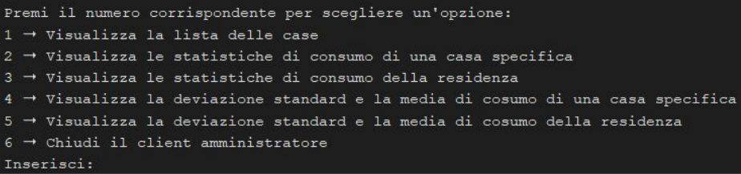
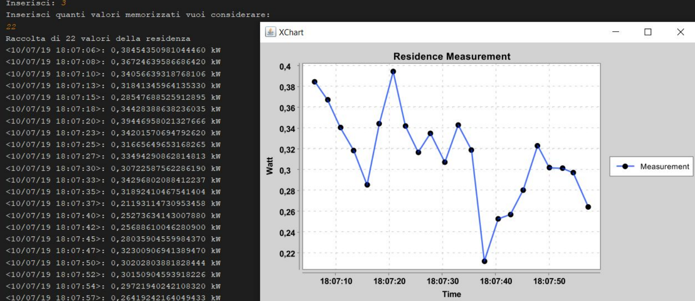
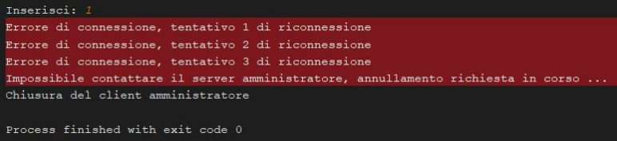
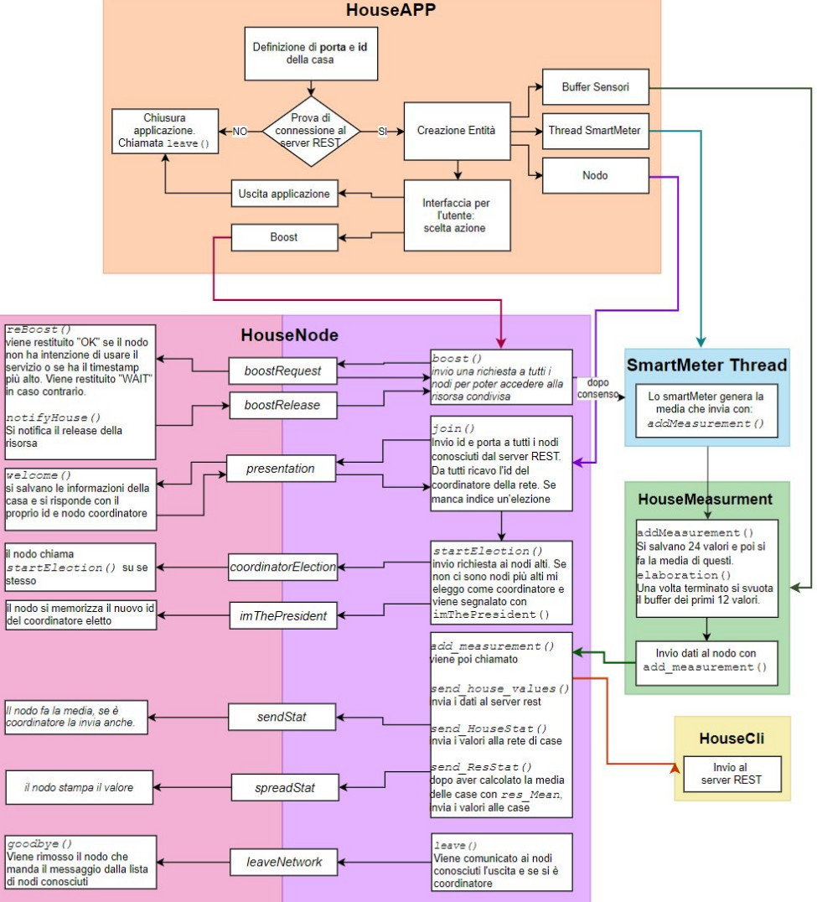
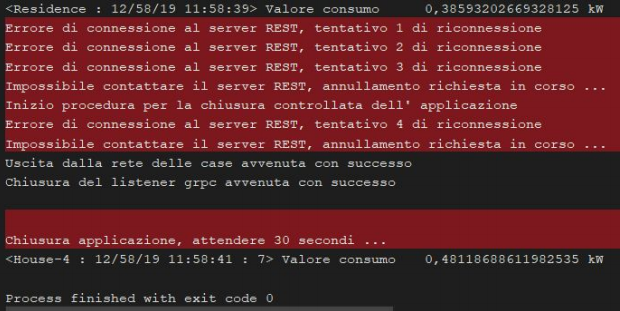
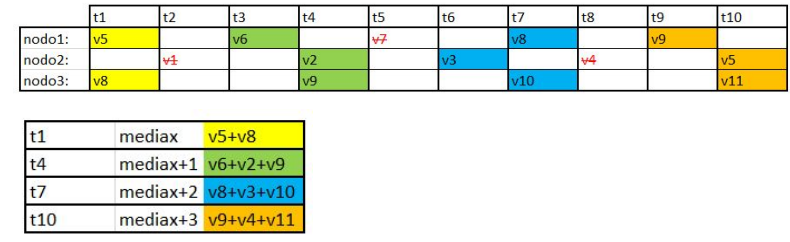
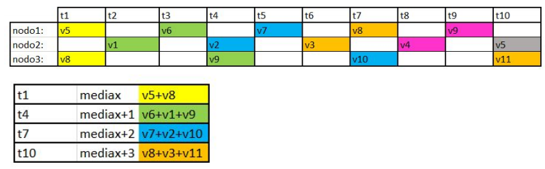

> Progetto di Sistemi distribuiti e pervasivi - Bassi Francesca 921900

# Struttura del progetto
Il progetto è composto da 3 eseguibili: HouseAPP, StartServer, AdminCli.
* StartServer è il processo che permette di inizializzare il serve REST a cui i processi
case e client amministratore potranno rivolgersi.
* HouseApp è il processo casa che comunica con gli altri processi HouseAPP e il
serverRest.
* AdminCli è il processo che permette all’utente amministratore di ottenere
informazioni dalle case, come la quantità, le loro statistiche e le medie.

# Entità coinvolte nel Server REST
## Residence
Residence è la classe che implementa la gestione delle case e delle loro informazioni.
Metodi:
* `add_house_to_list(House h)`: Prendendo in input un oggetto House, lo aggiunge in
modo sincronizzato alla struttura dati che contiene tutte le case della residenza.
* `add_house_to_list(int id, String ip, int port)`: Lo stesso metodo con un
prototipo differente permette di creare un oggetto House e aggiungerlo alla struttura dati,
passando solo id, indirizzo e porta della casa.
* `rm_house_to_list(House h)`: Prendenedo in input un oggetto House, rimuove in modo
sincronizzato l’oggetto dalla struttura dati che memorizza le case della residenza.
* `rm_house_to_list(int id)`: Lo stesso metodo precedente con un prototipo differente,
permette di rimuovere una casa dalla lista mediante l’id di quest’ultima.
* `statistics(int id, int n)`: Crea una sublist, in modo sincronizzato, di n elementi
più recenti dalla lista di medie locali generate dalla casa con identificativo id.
statistics (int n): Crea una sublist di n elementi più recenti dalla lista delle medie
globali, cioè della residenza.
* `updateStatistics (int id, SensorMeasurement value)`: Metodo sincronizzato
che permette di aggiornare i valori locali di una casa con identificativo id.
* `updateStatistics (SensorMeasurement value)`: Metodo sincronizzato che
permette di aggiornare i valori globali della residenza.
* `get_mean_stDeviation(int id, int n)`: Metodo che attraverso una sublist di valori
della casa con identificativo id (sublist generata da statistics(int id, int n))
calcola media e deviazione standard.
* `get_mean_stDeviation(int n)`: Metodo che attraverso una sublist di valori della
residenza (sublist generata da statistics(int n)) calcola media e deviazione standard.

## AdminServer
Classe che si occupa di implementare le richieste POST e GET.
Ogni richiesta che necessita di una lettura di un parametro passato con @PathParam viene
controllato attraverso una regex per evitare di trovare valori inadeguati.
## I metodi POST sono
* `rm_house(House h)`: chiama il metodo rm_house_to_list (House h).
* `add_house(House h)`: chiama il metodo add_house_to_list(House h).
* `add_value(SensorMeasurement sn)`: chiama il metodo updateStatistics.
* `add_values(SensorMeasurement sn, int id)`: chiama il metodo
* `updateStatistics(int id, SensorsMeasurement)`: aggiorna le statistiche

## I metodi GET sono
* `get_stat(int n, int id)`: chiama il metodo statistics(int n, int id).
* `get_stat(int n)`: chiama il metodo statistics(int n).
* `get_mean_stDev(int n, int id)`: chiama il metodo get_mean_stDeviation.
* `get_mean_stDev(int n)`: chiama il metodo get_mean_stDeviation(int n).
* `get_house_list()`: chiama `get_house()` che restituisce la lista di casa in modo
sincronizzato

# Entità coinvolte nel client Amministratore
Il processo AdminCli serve per permettere all’amministratore di interrogare il server
amministratore attraverso le chiamate REST.
AdminCli fornisce un’interfaccia che permette all’utente di scegliere tra 6 funzioni.

Quando viene richiesto di visualizzare le statistiche di consumo di una casa specifica o della
residenza, oltre alla stampa sul terminale, viene creato un plot attraverso la classe
“AdminChart”.

Il processo AdminCli gestisce la disconnessione improvvisa del serverREST.
Al momento che il client amministratore non è più in grado di comunicare con il serverREST,
vengono fatti 3 tentativi di comunicazione, poi si avvia la procedura di chiusura del processo.

# Entità coinvolte nella rete della casa

## HouseAPP
HouseAPP è il processo con cui l’utente della casa può formare la casa, chiedere il boost e
chiedere al processo di interrompersi.

Il processo fa assegnare un valore numerico inferiore a 16.383 da parte dell’utente. A questo
id viene sommato un numero (49.152 il numero minimo di porta). Ciò permette di avere un id
e una porta univoca, un random infatti potrebbe attribuire la stessa porta a due processi con
id differenti. Il problema si potrebbe risolvere anche attraverso l’intervento del server REST,
infatti potrebbe controllare che anche la porta sia univoca.

Successivamente il HouseAPP manda una richiesta al server per ottenere la lista di case
memorizzate nel server, cioè già all’interno della rete p2p. Con questa lista è possibile
istanziare un oggetto di tipo HouseNode, oggetto che si occuperà di interagire con gli altri
nodi della rete. Viene istanziato il buffer e infine creato il thread che si occupa di generare le misurazioni.

Una volta conclusa la fase di istanziazione, viene mostrata l’interfaccia con cui interagire con il nodo. Le opzioni sono appunto: rimuovere la casa dalla rete, richiedere l’uso del boost.

Il processo termina correttamente alla chiusura imprevista del server. Dopo il messaggio
della chiusura del listener grpc è necessario premere un tasto per attivare l’input listener.

## HouseMeasurement
La classe che implementa Buffer, raccoglie le misurazioni generate dal thread e le comunica
al nodo.
`addMeasurement()`: è il metodo che prende in input i dati e li memorizza in un buffer.
Quando il buffer delle misurazioni raggiunge la dimensione di 24 elementi (la window size),
in cui viene chiamato il metodo `elaboration()` che crea un nuovo buffer per la media (array)
inizializzato con i 24 valori. Il buffer delle misurazioni viene dimezzato, cioè svuotato dei
primi 12 elementi (overlap del 50%) ed è pronto per nuove misurazioni. Intanto il buffer per
la media viene utilizzato per fare il calcolo effettivo, come risultato genererà un oggetto
Measurement con un id univoco. Infine questo risultato viene comunicato al nodo.

## HouseCli
Istanza che si interfaccia al serverREST, serve per comunicare le medie locali e globali, la
richiesta di accesso e la richiesta di uscita dal server.
## House Server
Istanza che serve per inizializzare il servizio GRPC.
## HouseBroadcast
Classe che implementa Runnable che serve per simulare l’invio parallelo dei messaggi in
broadcast.
## BoostThread
Istanza che serve per chiamare il boost() nel thread del simulatore. Regola le strutture dati
per la richiesta di boost.
## HouseNode
Istanza che permette di interfacciare la casa nella rete p2p. Il nodo si prende in carico il
compito di gestire le comunicazioni tra i diversi nodi e verso il serverREST.
## HouseSevice
Istanza che implementa i servizi GRPC che vengono usati dal HouseServer.

# Struttura comunicazioni
## Presentazione
La presentazione parte nel costruttore dell’oggetto nodo, attraverso `join()`. La prima cosa
che il nodo controlla è il numero di nodi nella rete, se è l’unico nodo, si autoproclama
coordinatore senza indire l’elezione distribuita. Se ci sono più nodi, viene creata una
struttura dati in cui verranno raccolti tutti gli identificativi del coordinatore ricevuti in risposta
dagli altri nodi. Viene creato un messaggio in cui si comunica semplicemente id e numero di
porta del nodo. Ad ogni risposta ricevuta(`onNext()`), il nodo controlla se ha già quella casa
tra i record forniti dal server, se no, viene aggiunta. Successivamente si memorizza il
coordinatore fornito da chi risponde e lo memorizza nella struttura dati. In caso di errore di
comunicazione (`onError()`) alla struttura dati viene aggiunto un “-1” per fare numero.
Una volta che hanno risposto tutti i nodi presenti, si controlla chi qual è l’id con la
maggioranza tramite il metodo `set_coordinator()`, l’id con occorrenza maggiore è il
coordinatore.

I nodi che ricevono un messaggio di presentazione usando il metodo `welcome()`
memorizzano le informazioni del nuovo nodo e creano un messaggio con le loro
informazioni (id e porta) e il coordinatore conosciuto.
## Rimozione
Dall’interfaccia del processo HouseAPP l’utente può richiedere la rimozione controllata del
nodo. Nel nodo viene chiamato il metodo` leave()`, in cui attraverso l’istanza HouseCli
chiede la rimozione dal serverREST. Successivamente costruisce un messaggio con il
proprio id e se è coordinatore.

I nodi che ricevono il messaggio di rimozione usando il metodo `goodbye()`, il metodo
rimuove il nodo con quell’id dalla propria struttura dati. Se il nodo che risponde stava
cercando di accedere alla risorsa, si fa mandare l’”OK” virtuale dal nodo che ha segnalato
l’uscita. Infine se il nodo che viene rimosso è coordinatore, si indice un’elezione

## Richiesta del Boost
Dall’interfaccia del processo HouseAPP l’utente richiede l’utilizzo della risorsa condivisa.
Utilizzando l’algoritmo di Ricart Agrawala, il nodo deve chiedere il consenso agli altri nodi
per ottenere l’accesso alla risorsa.
Viene usato il metodo `boost()`, in questo metodo si setta a true il boolean per indicare che
il nodo vuole usare la risorsa condivisa, poi viene assegnata la variabile long che contiene il
timestamp del momento della risorsa. Successivamente viene creato il messaggio da
comunicare agli altri nodi con id del nodo e il timestamp usato. In risposta attende un
messaggio da ogni nodo con all’interno un messaggio “OK” oppure “WAIT”, questi messaggi
vengono memorizzati in un dizionario che ha per chiave l’id del nodo che risponde e come
valore la risposta. Per i messaggi che subiscono errori (`onError()`) il messaggio conterrà
“LOST”. Una volta che tutti i nodi hanno risposto, si contano le occorrenze dei “WAIT” nel
dizionario. Se sono più di 1, il nodo non può usare la risorsa condivisa e attendere.
Infatti se la risorsa può essere usata da due nodi, è possibile utilizzarla anche con un “WAIT”
solo.

Il nodo che riceve una richiesta di utilizzo della risorsa risponde con il metodo reBoost(),
costruisce un messaggio inserendo il proprio id e una stringa, “OK” se non si sta usando la
risorsa o se si vuole usarla, ma il timestamp è più recente della richiesta a cui sta
rispondendo. Altrimenti “WAIT” se sta usando la risorsa o se deve usare la risorsa e il
timestamp è più vecchio di quello della richiesta, infine si memorizza l’id del nodo che sta
chiedendo al risorsa che ha ricevuto un “WAIT” come risposta.

Una volta che il nodo termina di utilizzare la risorsa condivisa, manda un messaggio alla lista
dei nodi in attesa con un “OK”, ogni nodo aggiornerà il proprio dizionario e testerà se potrà o
meno ottenere l’accesso alla risorsa.

## Elezione
Il nodo che inizia un’elezione con il metodo `startElection()` controlla se ci sono nodi
oltre a se stesso nella sua lista di nodi, se no si autoproclama coordinatore. Altrimenti il nodo
crea una sublist gli identificativi maggiori di se stesso, se questa è vuota, si autoproclama
coordinatore oppure invia a questi un messaggio per annunciare la richiesta di elezione di
un nuovo coordinatore. I nodi che ricevono la richiesta intervengono allo stesso modo, quindi
cercano i maggiori di se stessi e continuano a propagare finchè qualcuno non si proclama
coordinatore.
Quando un nodo si proclama coordinatore usando il metodo `imThePresident()`, metodo
che invia un messaggio a tutti i nodi della rete per segnalare il nuovo coordinatore a tutti.

## Invio dei dati
Appena una casa riceve una nuova misura, con il metodo `Send_HouseStat()` la misura
viene comunicata al serverREST e viene creato un messaggio che contiene l’id del nodo, la
misura generata e l’id della misura, questo messaggio viene propagato ai nodi della rete.
Quando un coordinatore genera una media globale, oltre all’invio di questa al serverREST,
viene propagata ai nodi nella rete con il metodo `Send_ResStat()`.

Calcolo della media: attualmente ci sono due approcci implementati.
Il nodo che riceve la nuova misura di una determinata casa memorizza il valore in un
dizionario che ha per chiave gli id delle case e per valore la media più aggiornata
corrispondente alla sua chiave (cioè all’id di quella casa).

La struttura dati è un dizionario che ha per chiave gli id delle case, mentre per valore un
arraylist di valori. Le medie vengono calcolate prendendo tutti i valori. Se una casa viene
disconnessa e ha ancora dei valori cachati, questi rientreranno nelle medie globali finchè
non termineranno i valori.

# Gestione dei nodi che interrompono la comunicazione
Il controllo dei nodi che muoiono in maniera non controllata è una seconda funzionalità
dell’invio delle statistiche. Dato che sarebbe richiesto un messaggio di check ogni poco
tempo, piuttosto che aggiungere messaggi per controllare le connessioni, controllo che un
nodo è ancora attivo mediante la comunicazione più frequent, quindi l’invio delle statistiche
alle altre case.
Il controllo avviene in questa maniera: ho un arraylist inizializzato con tutti gli id delle case
presenti nella rete e un contatore inizializzato a zero.
Nel `onNext()` viene incrementato il contatore di 1 e viene eliminato l’id dall’arraylist che ha risposto (informazione contenuta nel messaggio di risposta alle statistiche). Nel `onError()`
invece si controlla il genere di errore, se è UNAVAILABLE significa che c’è stato un errore
di connessione, quindi viene incrementato il contatore.
Ad ogni `onNext` e `OnError` viene chiamato un metodo chiamato `checkMiss()`.
Questo metodo controlla che il contatore abbia come valore un numero uguale al numero di
messaggi inviati dal nodo (che corrisponde alla dimensione della lista di case memorizzate),
se il contatore ha questo valore, significa che tutti hanno risposto in modo affermativo(con
`onNext`) o con un errore (in `onError`).
A questo punto `checkMiss` ha il compito di controllare se ci sono uno o più id nell’arraylist
di id. Se sì, vuol dire che sono id che non hanno risposto correttamente.
Si cerca di stabilire una comunicazione simmetrica. Se ha successo, significa che c’è stato
un errore di connessione momentaneo, quindi il nodo che non aveva risposto non viene
eliminato. In caso contrario si continua con la procedura di rimozione del nodo, in cui si
recupera il messaggio di boost se necessario, si manda un messaggio al serverREST per
chidere la rimozione di questo nodo (quindi sono i testimoni a rimuovere i nodi morti), si
rimuove il nodo e infine si inizia l’elezione se questo era un nodo coordinatore.